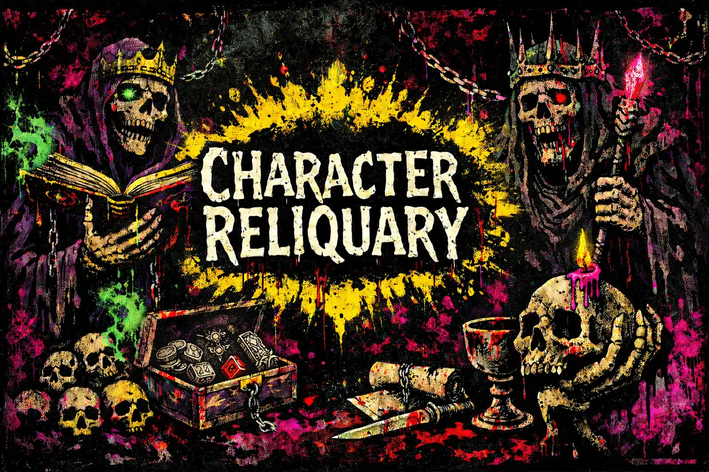

# MORK BORG Character Reliquary

<p align="center">
  
</p>

A lightweight web app for generating, editing, and storing MORK BORG character sheets.

## Run

1. Open `index.html` directly in your browser.
2. Optional local server:
   - `python3 -m http.server` (from this directory)
   - Open `http://localhost:8000`

## Responsive Images

Use the helper script to generate mobile and desktop variants from one source image:

```bash
scripts/prepare-responsive-image.sh --input assets/logos/CRBanner.png
```

Defaults:

- mobile max size: `900`
- desktop max size: `1800`
- output dir: same as source
- output format: `webp`
- quality: `82` (`--quality` to override)
- requires `cwebp` (libwebp)

The script prints a ready-to-paste `<picture>` snippet after generation.

## Features

- Gothic-themed responsive UI (desktop + mobile).
- Full sheet editor for Identity, Core Stats, Survival, Equipment, Powers, and Notes.
- Classless random character generation with confirmation before overwriting an existing sheet.
- Local autosave with `localStorage` and multi-character vault with quick switching.
- JSON import/export for backup and transfer.
- Expanded selectable options (class, homeland, weapon, armor, attack stat) plus custom weapon/armor entries with editable `d` values.
- Interactive HP tracker (`+` / `-`) with Max HP clamping, low-HP danger styling, and `BROKEN` state at 0 HP.
- Powers section with cast attempt counter, known-powers list builder, scroll counters, and notes.
- Integrated collapsible dice tray with:
  - 3D dice (`d2`, `d4`, `d6`, `d8`, `d10`, `d12`, `d20`, `d100`)
  - active die buttons, dynamic roll label, clear dice action, and click-to-reroll behavior
  - in-tray status, last-10-roll history, and one-click ledger purge
  - advanced options (`Force 2D Fallback`, `Low Performance`)
- Lazy-loaded dice module (`dice.js`) for better initial page load performance.
- Themed quick-reference rules section in-app.
- Sinner/Saint theme toggle with dark mode default.

## Data Storage

Character sheets are stored locally in your browser using:

- `morkborg-reliquary.characters.v1`
- `morkborg-reliquary.active.v1`

Dice tray settings and history are also stored locally:

- `mb_dice_settings_v1`
- `mb_dice_history_v1`
