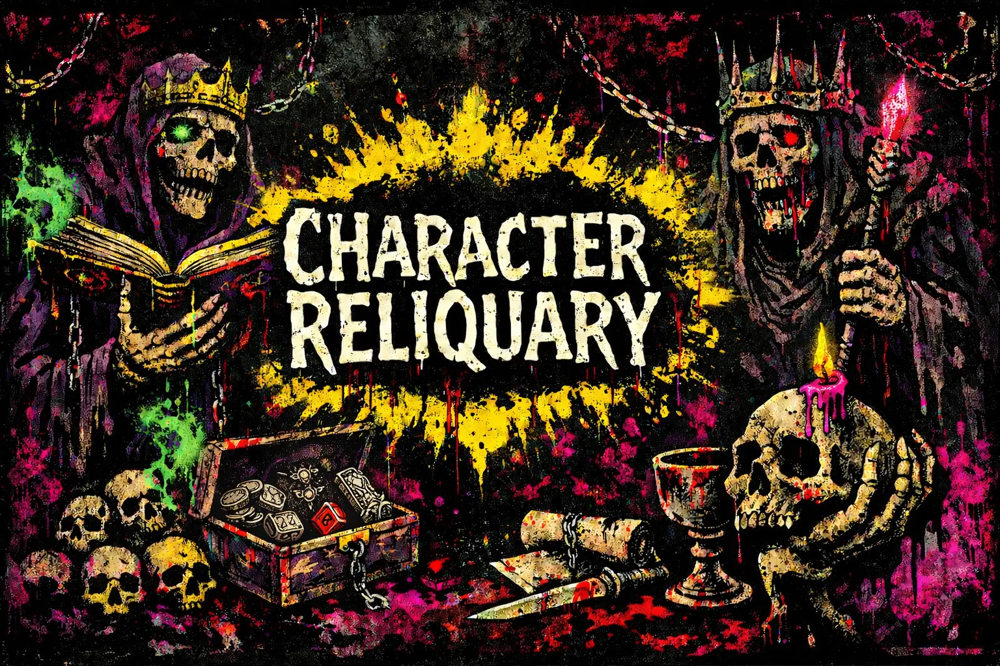

# MORK BORG Character Reliquary

<p align="center">
  
</p>

A lightweight web app for generating, editing, and storing MORK BORG character sheets.

## Run

1. Open `public/index.html` directly in your browser.
2. Optional local server:
   - `python3 -m http.server --directory public`
   - Open `http://localhost:8000`
3. For service worker/PWA testing, use `http://localhost` or `https` (not `file://`).

## Deploy

- Cloudflare Pages:
  - Framework preset: `None` (or `Static HTML`)
  - Build command: leave empty (or `exit 0`)
  - Build output directory: `public`
- Cloudflare Workers (`npx wrangler deploy`):
  - `wrangler.jsonc` is configured to serve static assets from `public`
  - Run from repo root: `npx wrangler deploy`
- GitHub Pages (GitHub Actions):
  - Workflow: `.github/workflows/deploy-github-pages.yml`
  - Repository setting: **Settings -> Pages -> Build and deployment -> Source = GitHub Actions**
  - Deploy trigger: push to `main` (or run workflow manually)

## Security Hardening

- A restrictive Content Security Policy is set in `public/index.html` via a `<meta http-equiv="Content-Security-Policy">` tag.
- `Referrer-Policy` is set via `<meta name="referrer" content="strict-origin-when-cross-origin">`.
- For GitHub Pages, this is the practical option because custom HTTP response headers are not configurable per site.
- When fronted by a host/CDN that supports response headers, move CSP and related security headers to HTTP headers for stronger coverage.

## PWA (Install + Offline)

- Install support:
  - Chromium browsers: use the install button in the address bar/menu.
  - iOS/iPadOS Safari: **Share -> Add to Home Screen**.
- Offline guarantee:
  - After one successful online load, the app shell is cached and should reload offline.
  - Sheet editing, saves, theme toggle, and dice tray remain available offline once cached.
- Troubleshooting stale assets:
  - In browser site settings, clear site data for the app origin and reload online.
  - If needed, unregister the service worker in DevTools (`Application -> Service Workers`) and reload.

## Responsive Images

Use the helper script to generate mobile and desktop variants from one source image:

```bash
scripts/prepare-responsive-image.sh --input public/assets/logos/CRBanner.png
```

Defaults:

- mobile max size: `900`
- desktop max size: `1800`
- output dir: same as source
- output format: `webp`
- quality: `82` (`--quality` to override)
- requires `cwebp` (libwebp)

The script prints a ready-to-paste `<picture>` snippet after generation.

## Vendor Update Monitor

A scheduled GitHub Action checks vendored libraries against npm latest versions:

- workflow: `.github/workflows/vendor-update-check.yml`
- schedule: weekly (Mondays, 14:00 UTC)
- manual run: Actions tab -> **Vendor Update Check** -> **Run workflow**

If updates or lookup errors are detected, the workflow creates or updates one GitHub issue:

- `Vendor library updates available`

When no updates/errors remain, the workflow closes that issue automatically.

## Features

- Gothic-themed responsive UI (desktop + mobile).
- Full sheet editor for Identity, Core Stats, Survival, Equipment, Powers, and Notes.
- Classless random character generation with confirmation before overwriting an existing sheet.
- Local autosave with `localStorage` and multi-character vault with quick switching.
- JSON import/export for backup and transfer.
- Expanded selectable options (class, homeland, weapon, armor, attack stat) plus custom weapon/armor entries with editable `d` values.
- Interactive HP tracker (`+` / `-`) with Max HP clamping, low-HP danger styling, and `BROKEN` state at 0 HP.
- Powers section with cast attempt counter, known-powers list builder, scroll counters, and notes.
- Integrated collapsible dice tray with:
  - 3D dice (`d2`, `d4`, `d6`, `d8`, `d10`, `d12`, `d20`, `d100`)
  - active die buttons, dynamic roll label, clear dice action, and click-to-reroll behavior
  - in-tray status, last-10-roll history, and one-click ledger purge
  - advanced options (`Force 2D Fallback`, `Low Performance`)
- Lazy-loaded dice module (`dice.js`) for better initial page load performance.
- Themed quick-reference rules section in-app.
- Sinner/Saint theme toggle with dark mode default.

## Data Storage

Character sheets are stored locally in your browser using:

- `morkborg-reliquary.characters.v1`
- `morkborg-reliquary.active.v1`

Dice tray settings and history are also stored locally:

- `mb_dice_settings_v1`
- `mb_dice_history_v1`
